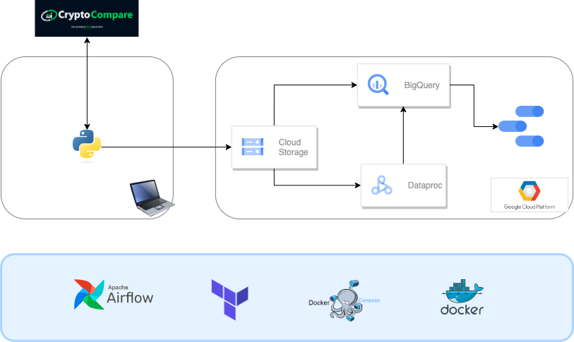

# Data Engineering Project - Coin Price

## Description

This project was conducted as the project challenge of the 
[DPhi Data Engineering bootcamp](https://dphi.tech/learn/data-engineering/). The goal is to apply everything learned in this course and build an end-to-end data pipeline.

## Dataset

This project obtains last minute price information about 5 different coins, namely BTC, ETH, USDT, USDC, and BNB (no specific reason for selecting these specific 5 coins), in a given currency, (in this case Euro (€)), and calculates hourly metrics that are presented in a Dashboard.

To accomplish this it was used the [CryptoCompare API](https://min-api.cryptocompare.com/) in order to obtain the data. The API is free to use if rate does not pass a certain limit, which this project does not.
The selected API responds with the following info. Only the first four elements, as long as the pair (coin, currency), were used.
* time - The unix timestamp for the start of this data point.
* high - The highest price of the requested pair during this period of time.
* low - The lowest price of the requested pair during this period of time.
* open - The price of the requested pair at the start of this period of time.
* volumefrom - The total amount of the base currency traded into the quote currency during this period of time (in units of the base currency).
* volumeto - The total amount of the quote currency traded into the base currency during this period of time (in units of the quote currency).
* close - The price of the requested pair at the end of this period of time.
* conversionType - Whether a conversion had to be used where a direct market wasn’t available and which type of conversion was used.
* conversionSymbol - Which currency was used for the conversion path.

## Architecture and Technologies

The following figure depicts the architecture.

The technologies were the following ones: 
* Cloud: GCP
* Container: Docker
* Infrastructure as code (IaC): Terraform
* Workflow orchestration: Airflow
* Storage / DataLake: GCS
* Data Warehouse: BigQuery
* Batch processing: Dataproc (Spark)
* Dashboard: Google Data Studio

The data pipelines were set as batch processing.

Every minute, a job running in a Docker makes the API calls to get the data and ingest this data to a bucket in GCS.

Every hour, two jobs would run. A first one that would take all data from the previous hour and ingest it in BQ, in a table partitioned by time and clustered by coin. The second job creates a Spark cluster in Dataproc, aggregates the data from the previous hour and calculates a set of metrics, which are again ingested in a production table partitioned by time and clustered by coin as well. 

The dashboard used for reporting/monitoring is built on top of this last table.

All steps are orchestrated in multiple steps in DAGs using Airflow.

The infrastructure is maintained mainly using Terraform.

## Setup

This project has as pre-requisites: 
* GCP account
* Terraform
* Docker

For more info on how to setup this architecture and run the code, please check the following documentation:

1. [setup_gcp.md](./setup/setup_gcp.md) 
2. [setup_terraform.md](./setup/setup_terraform.md) 
3. [setup_airflow.md](./setup/setup_airflow.md) 

## Dashboard

The dashboard is built with Data Studio. The dashboard can be accessed [here](https://datastudio.google.com/reporting/86c85a56-5b59-42e6-8c48-95aaa2c2bc0d) and the following image is an export.

The dashboard contains 4 tiles, and a filter for time (dates) is used.
* Top left: number of record for each coin
* Top right: historical maximum and minimum minute-averaged price for each coin
* Bottom left: Daily maximum of minute-averaged price for each coin by time
* Bottom right: the hourly minute-average price for each coin by time

## Next Steps

Many improvements could be explored: 
* More cloud components (e.g., Cloud Composer instead of Airflow)
* Include testing
* Use CI/CD
* More visualizations